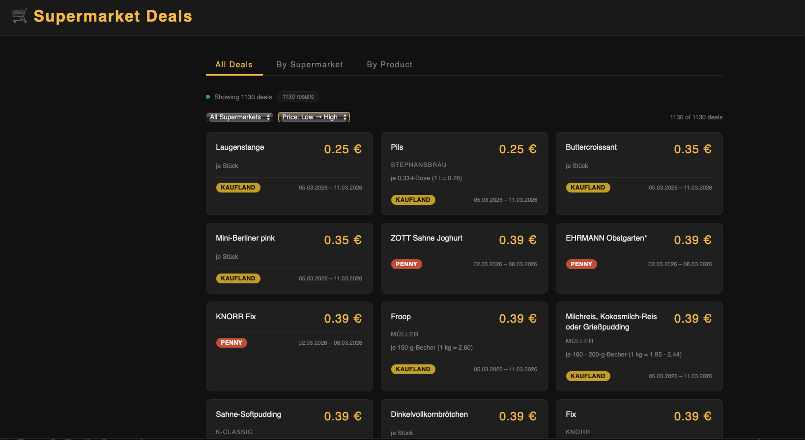
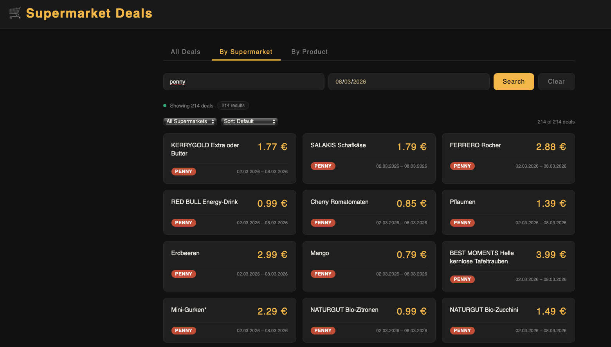
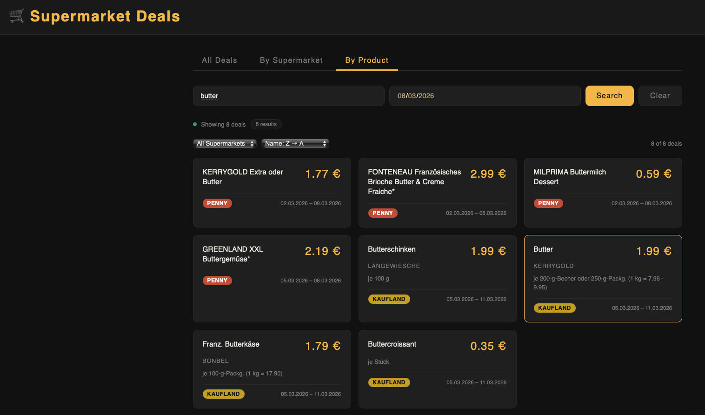

# Supermarket Deals

A Spring Boot application for managing and retrieving supermarket deals. This project provides a REST API to store, retrieve, and manage deals from various German supermarkets, along with a web scraper to automatically collect deals from online sources.

## Features

- **Deal Management**: CRUD operations for supermarket deals
- **Supermarket and Product Management**: Store information about supermarkets and products
- **Active Deals Retrieval**: Get active deals by supermarket name or product name
- **Web Scraping**: Automated scraping of deals from Penny, Kaufland, Rewe, Aldi Nord, and Aldi Süd
- **REST API**: Full RESTful API with JSON responses
- **Database Integration**: Uses PostgreSQL for data persistence

## Prerequisites

- Java 21
- Maven 3.6+
- PostgreSQL database
- Python 3.x (for the web scraper)

## Technologies Used

- **Spring Boot 3.5.10**: Framework for building the application
- **Spring Data JPA**: For database operations
- **PostgreSQL**: Database
- **Lombok**: For reducing boilerplate code
- **Maven**: Build automation tool

- **HTML/CSS/JavaScript**: Frontend technologies for the home page

- **Python**: For web scraping
- **BeautifulSoup**: Python library for HTML parsing
- **Selenium**: Python library for web browser automation
- **Requests**: Python library for HTTP requests

## Installation

1. Clone the repository:
   ```bash
   git clone <repository-url>
   cd supermarket-deals
   ```

2. Set up the PostgreSQL database:
   - Create a database named `supermarketdeals`
   - Update `src/main/resources/application.properties` with your database credentials:
     ```
     spring.datasource.username=your-username
     spring.datasource.password=your-password
     ```

3. Build the project:
   ```bash
   mvn clean install
   ```

## Running the Application

1. Start the Spring Boot application:
   ```bash
   mvn spring-boot:run
   ```

   The application will start on `http://localhost:8080/home.html`

2. Run the web scraper to populate deals:
   ```bash
   python src/main/java/com/example/supermarket_deals/scrapper/MainScrapper.py
   ```

## User Interface

#### All Deals View



- Dashboard showing 1130+ weekly deals scraped from Kaufland, Penny, Rewe, Aldi and more.
- Deals displayed as cards with product name, price, and validity period.
- Supports filtering by supermarket, sorting by price/name, and searching by product or store.

#### Get All Deals of a Supermarket


- Search deals by supermarket name with an optional date filter.  

### Search by Product

- Search across all supermarkets for a specific product by name.

## Testing

Run the tests with:
```bash
mvn test
```


## Disclaimer

It collects publicly available weekly supermarket offers
from websites like Aldi, Rewe and Kaufland for learning
purposes only.

All product data belongs to the respective supermarkets.